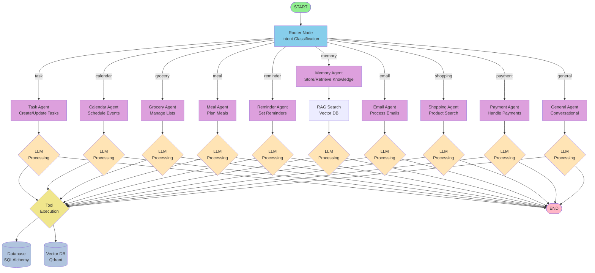

# FamilyOps Orchestrator - LangGraph Diagram

```mermaid
graph TD
    Start([START])
    
    Start --> Router[Router Node<br/>Intent Classification]
    
    Router -->|task| TaskAgent[Task Agent<br/>Create/Update Tasks]
    Router -->|calendar| CalendarAgent[Calendar Agent<br/>Schedule Events]
    Router -->|grocery| GroceryAgent[Grocery Agent<br/>Manage Lists]
    Router -->|meal| MealAgent[Meal Agent<br/>Plan Meals]
    Router -->|reminder| ReminderAgent[Reminder Agent<br/>Set Reminders]
    Router -->|memory| MemoryAgent[Memory Agent<br/>Store/Retrieve Knowledge]
    Router -->|email| EmailAgent[Email Agent<br/>Process Emails]
    Router -->|shopping| ShoppingAgent[Shopping Agent<br/>Product Search]
    Router -->|payment| PaymentAgent[Payment Agent<br/>Handle Payments]
    Router -->|general| GeneralAgent[General Agent<br/>Conversational]
    
    TaskAgent --> LLM1{LLM<br/>Processing}
    CalendarAgent --> LLM2{LLM<br/>Processing}
    GroceryAgent --> LLM3{LLM<br/>Processing}
    MealAgent --> LLM4{LLM<br/>Processing}
    ReminderAgent --> LLM5{LLM<br/>Processing}
    MemoryAgent --> RAG[RAG Search<br/>Vector DB]
    RAG --> LLM6{LLM<br/>Processing}
    EmailAgent --> LLM7{LLM<br/>Processing}
    ShoppingAgent --> LLM8{LLM<br/>Processing}
    PaymentAgent --> LLM9{LLM<br/>Processing}
    GeneralAgent --> LLM10{LLM<br/>Processing}
    
    LLM1 --> Tools{Tool<br/>Execution}
    LLM2 --> Tools
    LLM3 --> Tools
    LLM4 --> Tools
    LLM5 --> Tools
    LLM6 --> Tools
    LLM7 --> Tools
    LLM8 --> Tools
    LLM9 --> Tools
    LLM10 --> Tools
    
    Tools --> DB[(Database<br/>SQLAlchemy)]
    Tools --> VectorDB[(Vector DB<br/>Qdrant)]
    
    LLM1 --> End([END])
    LLM2 --> End
    LLM3 --> End
    LLM4 --> End
    LLM5 --> End
    LLM6 --> End
    LLM7 --> End
    LLM8 --> End
    LLM9 --> End
    LLM10 --> End
    
    style Start fill:#90EE90
    style End fill:#FFB6C6
    style Router fill:#87CEEB
    style TaskAgent fill:#DDA0DD
    style CalendarAgent fill:#DDA0DD
    style GroceryAgent fill:#DDA0DD
    style MealAgent fill:#DDA0DD
    style ReminderAgent fill:#DDA0DD
    style MemoryAgent fill:#DDA0DD
    style EmailAgent fill:#DDA0DD
    style ShoppingAgent fill:#DDA0DD
    style PaymentAgent fill:#DDA0DD
    style GeneralAgent fill:#DDA0DD
    style LLM1 fill:#FFE4B5
    style LLM2 fill:#FFE4B5
    style LLM3 fill:#FFE4B5
    style LLM4 fill:#FFE4B5
    style LLM5 fill:#FFE4B5
    style LLM6 fill:#FFE4B5
    style LLM7 fill:#FFE4B5
    style LLM8 fill:#FFE4B5
    style LLM9 fill:#FFE4B5
    style LLM10 fill:#FFE4B5
    style Tools fill:#F0E68C
    style DB fill:#B0C4DE
    style VectorDB fill:#B0C4DE

```
